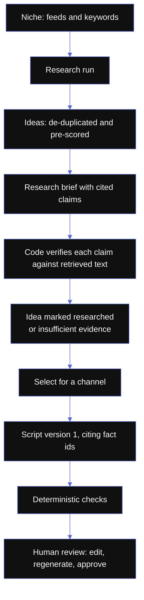

# Architecture

High-level diagrams for AI Content Factory.

## Research-to-script pipeline

```mermaid
%%{init: {'theme':'base','themeVariables':{'primaryColor':'#0F1011','primaryTextColor':'#F7F8F8','primaryBorderColor':'#5E6AD2','lineColor':'#5E6AD2'}}}%%
flowchart TD
    N[Niche: feeds and keywords] --> RR[Research run]
    RR --> ID[Ideas: de-duplicated and pre-scored]
    ID --> BR[Research brief with cited claims]
    BR --> V[Code verifies each claim against retrieved text]
    V --> RD[Idea marked researched<br/>or insufficient evidence]
    RD --> SEL[Select for a channel]
    SEL --> SC[Script version 1, citing fact ids]
    SC --> CK[Deterministic checks]
    CK --> REV[Human review: edit, regenerate, approve]
```

More diagrams (queues, provider fallback) will be added here later.
